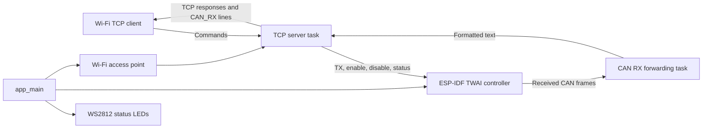

# DuoCAN-C6 Firmware Review

**Review date:** 2026-09-30  
**Scope:** Static review of project-owned firmware sources and configuration, plus the existing ESP-IDF build. No source code was changed.

## Executive Summary

DuoCAN-C6 is an ESP32-C6 CAN-to-Wi-Fi gateway. Its main path is operationally simple, but it exposes CAN transmission to any client that can join the configured access point, assumes TCP receive chunks align with commands, and reports CAN operations as successful without consistently checking their results. CAN receive processing, socket ownership, and controller/transceiver lifecycle also need clearer boundaries and failure handling.

The existing build completed for ESP32-C6 with ESP-IDF 5.3.1. The resulting application image was `0xd4ac0` bytes in a 1 MiB app partition, leaving about 17% free. This confirms compilation and partition fit, not runtime behavior or hardware timing.

## Architecture and Data Flow

`app_main()` initializes the LED driver and CAN controller, starts a CAN receive task, initializes the Wi-Fi access point, and starts the TCP server task. The main task then remains in a one-second delay loop.

There is no queue between CAN reception and TCP transmission. Both command responses and CAN telemetry write directly to the same client socket. LED status APIs exist for CAN, Wi-Fi, and TCP states, but the normal application only uses the basic boot/ready LED setters.

## Subsystem Review

### TinyUSB and USB

The project defines and enables `TINYUSB_ENABLED` and `TINYUSB_CDC_ENABLED` in its Kconfig, but the application has no TinyUSB calls and the main component does not declare a TinyUSB dependency. The active USB Serial/JTAG console is a separate ESP-IDF facility; it does not implement TinyUSB CDC for the application. The configuration currently advertises functionality that is not wired into the firmware. See [Kconfig.projbuild](main/Kconfig.projbuild#L6), [main/CMakeLists.txt](main/CMakeLists.txt#L12), and [sdkconfig](sdkconfig#L1082).

### ESP-IDF and CAN

The project targets ESP32-C6 with ESP-IDF 5.3.1. Wi-Fi, NVS, and RMT setup generally uses ESP-IDF APIs and `ESP_ERROR_CHECK`, which aborts on failure. CAN initialization instead logs errors and continues: `twai_start()` is attempted even if driver installation fails, and the rest of startup proceeds without a usable CAN controller.

TWAI is configured for normal mode at 500 kbit/s, with GPIO4/GPIO5 for TX/RX, 16-entry TX/RX queues, and an accept-all filter. Alerts are disabled, so the firmware has no event-driven bus-off or receive-overflow handling. `duocan_get_status()` ignores the status API result and formats the output regardless.

The code comment describes CAN transceiver enable, but the firmware configures no external transceiver enable/standby GPIO. `twai_start()` and `twai_stop()` control the ESP-IDF controller, not necessarily the physical transceiver. Confirm the board wiring and explicitly manage the transceiver pin if the design requires it. See [duocan_can.c](main/duocan_can.c#L15) and [duocan_can.c](main/duocan_can.c#L60).

### FreeRTOS Tasks

The normal firmware creates a CAN RX forwarding task and a TCP server task, each with a requested 4096-byte stack and priority 5. Both `xTaskCreate()` return values are ignored. `app_main()` also stays alive in a periodic delay loop after startup. The LED test harness has a separate `app_main()` and is not listed in the component's compiled source files, so it is not part of the normal application.

The active configuration is single-core with a 100 Hz FreeRTOS tick. Consequently, `pdMS_TO_TICKS(5)` rounds to zero; the CAN task's apparent five-millisecond delay does not provide a five-millisecond pause. Track task stack high-water marks and heap availability under Wi-Fi and CAN load rather than relying on configured stack sizes alone. See [main.c](main/main.c#L98), [main.c](main/main.c#L113), and [sdkconfig](sdkconfig#L1268).

### TCP Transport and Command Protocol

The server listens on port 1234 and handles one client at a time. Its listen backlog is one, and it blocks in `recv()` until the active client disconnects. A connected but idle client can therefore prevent another client from being served even though the AP permits up to four stations.

The command handler treats each `recv()` result as one complete command. TCP does not preserve application message boundaries, so fragmented commands and multiple commands arriving together are not handled reliably. Define newline-delimited input explicitly, buffer until complete lines are available, and reject or discard overlong lines.

Socket writes ignore errors and partial writes. CAN telemetry and command responses share a global client socket without synchronization; disconnect and descriptor reuse can race with CAN forwarding. A single network-owning task with a bounded outbound queue would make socket lifecycle and write ordering explicit.

### Memory, Buffers, and Concurrency

The TCP receive buffer is 256 bytes and CAN text output uses a 128-byte local buffer. For valid Classical CAN frames, the formatted CAN line is comfortably below 128 bytes. However, `duocan_send_can_frame()` copies `dlc` bytes into the TWAI message's eight-byte data field without enforcing the limit. The TCP caller rejects DLC above eight, but the public CAN function itself remains unsafe for other callers. The parser also accepts a command after reading only the ID and DLC; missing data bytes are silently zero-filled, and values above 255 are truncated when cast to `uint8_t`.

The CAN task performs a blocking socket send and logs every received frame before returning to the receive loop. Slow clients or logging overhead can delay queue draining; with a 16-frame receive queue, bursts can cause loss. A separate forwarding queue, explicit drop accounting, and rate-appropriate logging would prevent network backpressure from directly controlling CAN consumption.

WS2812 pixel state is held in a global array with no lock. The current startup path updates it sequentially, but concurrent calls from multiple tasks could produce inconsistent frames. The RMT path also does not explicitly encode a WS2812 reset/latch interval; confirm back-to-back update timing on hardware and provide a defined low interval if required.

The configured partition table is single-app. The existing image fits, but about 17% of the 1 MiB app partition remains; account for this constraint if adding features or planning OTA updates. Runtime heap and task-stack margins were not measured in this review.

## Risk Surface

- **CAN command exposure:** the AP uses a fixed source-level password, logs that password, and offers CAN transmit commands to connected clients without additional authorization. A client with the shared credential can inject frames.
- **Transport correctness:** TCP chunk boundaries are mistaken for command boundaries; concurrent sends and ignored partial writes can lose or confuse protocol output.
- **CAN reliability:** failures are not consistently propagated; bus-off and queue-overflow recovery are absent; receive processing is coupled to logging and network writes.
- **Memory safety:** CAN transmit's copy length is not bounded by the destination field size at the API boundary.
- **Hardware lifecycle:** no firmware control of a transceiver enable/standby pin is present; behavior depends on board wiring.
- **Operational observability:** task creation, CAN status failures, socket errors, heap margin, and stack high-water marks are not surfaced consistently.

## Recommended Improvements

1. **Secure CAN access:** replace the shared hard-coded credential with a provisioned per-device credential, remove secret logging, and add authorization for CAN-changing commands. Restrict the AP and protocol to the intended local use case.
2. **Define the TCP protocol:** implement line buffering and multiple-command processing, impose a maximum command length, validate exact `SEND` field counts/ranges, and handle partial writes and disconnects.
3. **Harden the CAN API:** validate DLC and data pointers inside the CAN module, initialize messages completely, validate standard/extended identifier ranges, return operation results, and distinguish queue acceptance from confirmed transmission.
4. **Make CAN lifecycle explicit:** propagate install/start/status errors, initialize the physical transceiver pin based on the schematic, enable relevant TWAI alerts, and implement bus-off recovery and queue-overflow reporting.
5. **Assign socket ownership:** send all TCP output through one task or serialized queue, define client timeout/connection policy, and avoid blocking CAN queue draining on a slow client.
6. **Measure resource margins:** record task stack high-water marks and heap under stress, assess the 1 MiB single-app partition against feature growth, and establish an OTA partition layout if updates are required.
7. **Validate LED behavior:** confirm WS2812 reset timing and serialize pixel updates if multiple tasks may use the API. Either wire the existing subsystem status APIs into real state transitions or remove unused status claims.
8. **Align USB configuration with implementation:** either integrate the intended TinyUSB CDC component and data path or remove the unused TinyUSB Kconfig options; document USB Serial/JTAG as the console/debug path.
9. **Add focused tests:** exercise TCP fragmentation/coalescing, malformed and boundary CAN commands, CAN driver failures/bus-off, disconnect races, and LED timing on hardware. The current LED harness is not built as part of the normal firmware target.

## Review Verification

The existing ESP-IDF build completed successfully for `esp32c6`; the application image fit the configured 1 MiB partition. No hardware-in-loop, network stress, or CAN bus-off test was run. This document summarizes the existing review; the review was not rerun to create it.